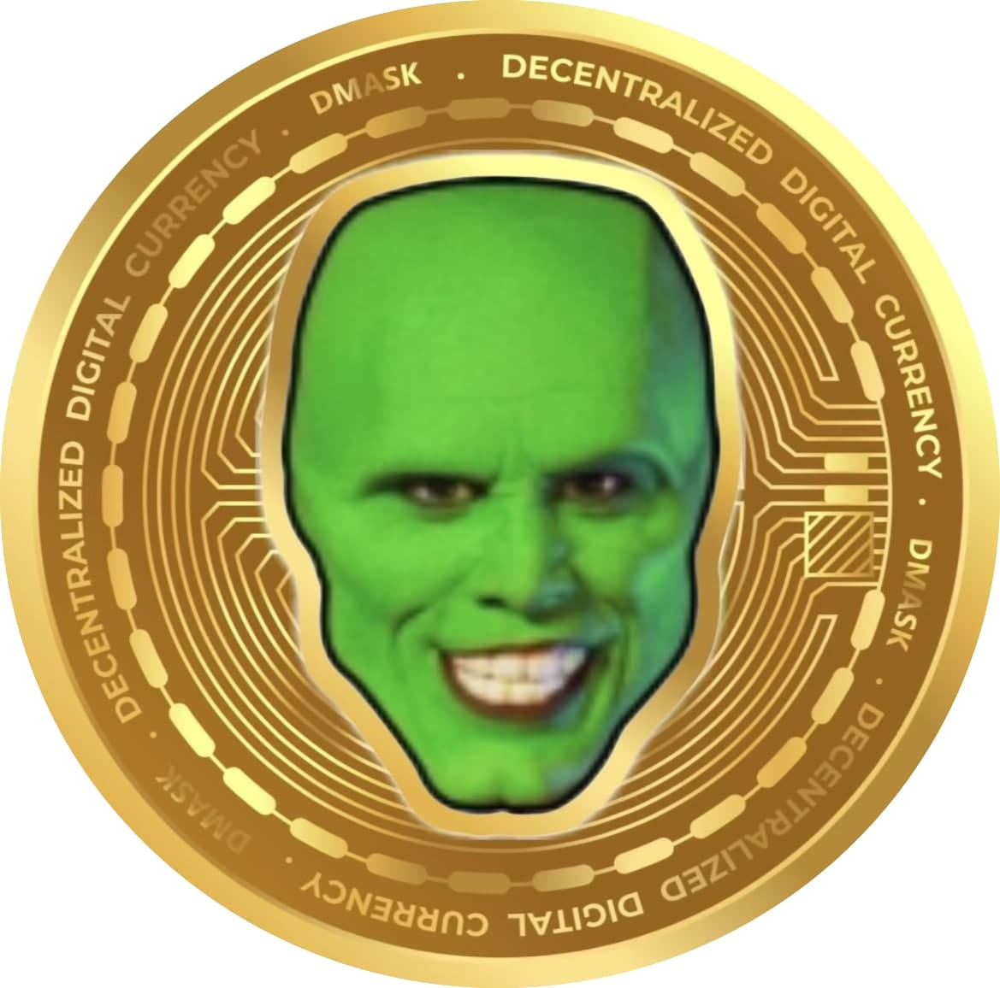

# The Mask Crypto Project

## What Is DMASK?

The Mask (DMASK) token is a community driven, DeFi Crypto Currency made on Binance smart chain with a deflationary supply and an automated redistribution mechanism that rewards holders. DMASK was launched on November 23, 2021, with a total supply of 20,000,000,000 DMASK. DMASK works by applying a 3% tax to each transaction. This tax is used as follows: 

- 1% is instantly distributed to the holders of DMASK. There is no need to farm or claim. Holders will simply see more DMSAK tokens in their wallet.

- 1% is burned to reduce the supply and increase the price floor of the token.

- 1% is sent to DMASK's lottery wallet. DMASKLottery is a unique way to reward and surprise holders. DMASKLottery works by distributing the accumulated tokens among lucky winners in weekly lottery events. Entry is free and each holder has an equal opportunity to win.

## BSC Contract Address

`0x42892de8d1feedc5a31823415ac43a8680c0df87`

## Join Our Community

[ **Website** ](themaskcrypto.com)

[ **Twitter** ](https://twitter.com/themaskcrypto)

[ **Instagram** ](https://www.instagram.com/themask.crypto/)

[ **Telegram** ](https://t.me/Dmaskcommunitytg)

